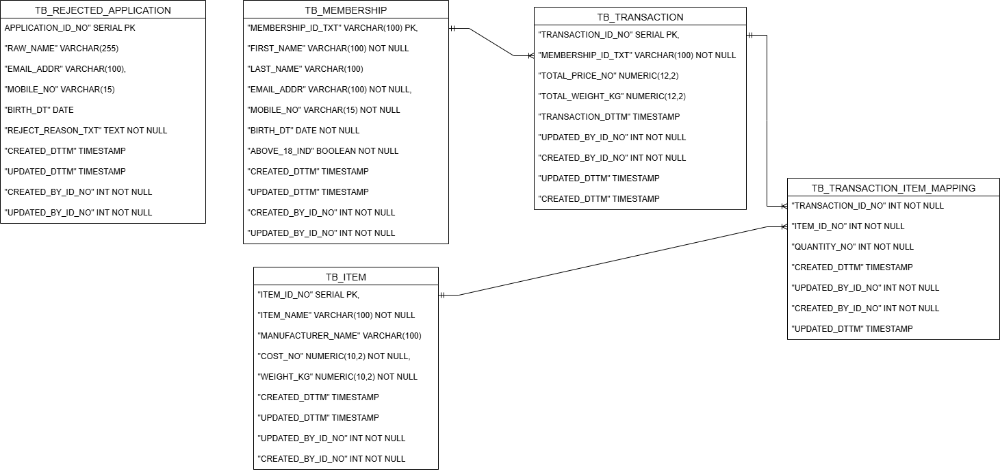

# Section2: Database
---

# Overview
This section covers the following deliverables:
- [Membership Application Pipeline](#membership-application-pipeline)
- [Database Design with Entity Relationship Diagram](#database-design-with-entity-relationship-diagram)
- [Dockerfile setup and PostgreSQL DDL statements](#dockerfile-setup-and-postgresql-ddl-statements)
- [Addressing Analyst Queries](#addressing-analyst-queries)

# Membership Application Pipeline
Flow:
1. Applications submitted → dropped into a cloud storage/input folder (e.g., input/).
2. Processing job using Python:
	- Reads application file.
	- Perform data validation.
	- Determines Success or Fail application.
	- Assigns Membership ID for successful applications.
4. Routing:
	- Success → stored in success/ location.
	- Fail → stored in fail/ location with reject reason.
	- Archive -> stored processed file.
5. Database Integration:
	- Successful applications are loaded into the members table in PostgreSQL for transaction reference.

This ensures clean lineage and referenceability.

[Back to Top](#overview)

# Database Design with Entity Relationship Diagram

We need to design memberships, items, transactions, and transaction details.
1. TB_MEMBERSHIP: created from successful applications.
2. TB_ITEM: product catalog.
3. TB_TRANSACTION: records purchases by members.
4. TB_TRANSACTION_ITEM_MAPPING: captures items within each transaction (many-to-many resolution).



Refer to init.sql for DDL and Test data.

[Back to Top](#overview)

# Dockerfile setup and PostgreSQL DDL statements
1. Install tool: Docker Desktop
2. Install tool: pgAdmin 4
3. Create the following files:
- **`init.sql`** – This will contain the entire SQL script to initialize the database.
- **`Dockerfile`** – This configuation defines how PostgreSQL is set up, by specifying user, password and database name.
- **`docker-compose.yml`** – This yml file manage the PostgreSQL container that I will setup, by using the username, password, database name and database port.
4. Open the Docker Desktop terminal.
5. Go to the project directory.
6. Run the following command to start the container:
```bash
docker-compose up -d --build
```
7. Ensure that the container is running:
8. Go to pgAdmin. Right click on server - register, in order to setup the database.
9. Verify the database is up and running by expanding the database which was just created.

[Back to Top](#overview)

## Applying data standard and guidelines
### 1. All the columns are harmonized with appended with classword as suffix:
- _NO is for number.
- _TXT is for text field.
- _IND is for indicator / 2 values field.
- _CD is for code values / fields with more than 2 possible values.
			
### 2. All the tables are harmonized with prefix: TB_, which represents base table.
### 3. Primary key and foreign keys are indicated accordingly.
### 4. Table descriptions are indicated accordingly.
### 5. Column descriptions are indicated accordingly.

# Addressing Analyst Queries
## Q1. Top 10 members by spending
~~~~sql
--Which are the top 3 items that are frequently brought by members ?
--We need to count total quantity purchased for each item across all transactions:
SELECT i."ITEM_ID_NO", i."ITEM_NAME", SUM(ti."QUANTITY_NO") AS total_quantity_sold
FROM "ASSESSMENT"."TB_TRANSACTION_ITEM_MAPPING" ti
JOIN "ASSESSMENT"."TB_ITEM" i ON ti."ITEM_ID_NO" = i."ITEM_ID_NO"
GROUP BY i."ITEM_ID_NO", i."ITEM_NAME"
ORDER BY total_quantity_sold DESC
LIMIT 3;

--Explanation:
--Join TB_ITEM and TB_TRANSACTION_ITEM_MAPPING to get purchase quantities.
--Aggregate total quantity per item (SUM(ti.QUANTITY_NO)).
--Order descending and take the top 3 most frequently purchased items.
~~~~

## Q2. Top 3 items that are frequently bought by members
~~~~sql
-- Which are the top 10 members by spending ?
-- We need to sum the total_price of all transactions per member and order by spending descending:
SELECT 
    m."MEMBERSHIP_ID_TXT",
    m."FIRST_NAME",
    m."LAST_NAME",
    m."EMAIL_ADDR",
    SUM(t."TOTAL_PRICE_NO") AS total_spent
FROM "ASSESSMENT"."TB_MEMBERSHIP" m
JOIN "ASSESSMENT"."TB_TRANSACTION" t ON m."MEMBERSHIP_ID_TXT" = t."MEMBERSHIP_ID_TXT"
GROUP BY m."MEMBERSHIP_ID_TXT", m."FIRST_NAME", m."LAST_NAME", m."EMAIL_ADDR"
ORDER BY total_spent DESC
LIMIT 10;

--Explanation:
-- Join TB_MEMBERSHIP and TB_TRANSACTION on membership_id_txt.
-- Aggregate total spending per member (SUM(t.total_price)).
-- Order by total_spent descending and take the top 10.
~~~~

## Next
Automate the data harmonization (i.e. logical modeling and physical modeling) for every new tables brought in to the system.

[Back to Top](#overview)