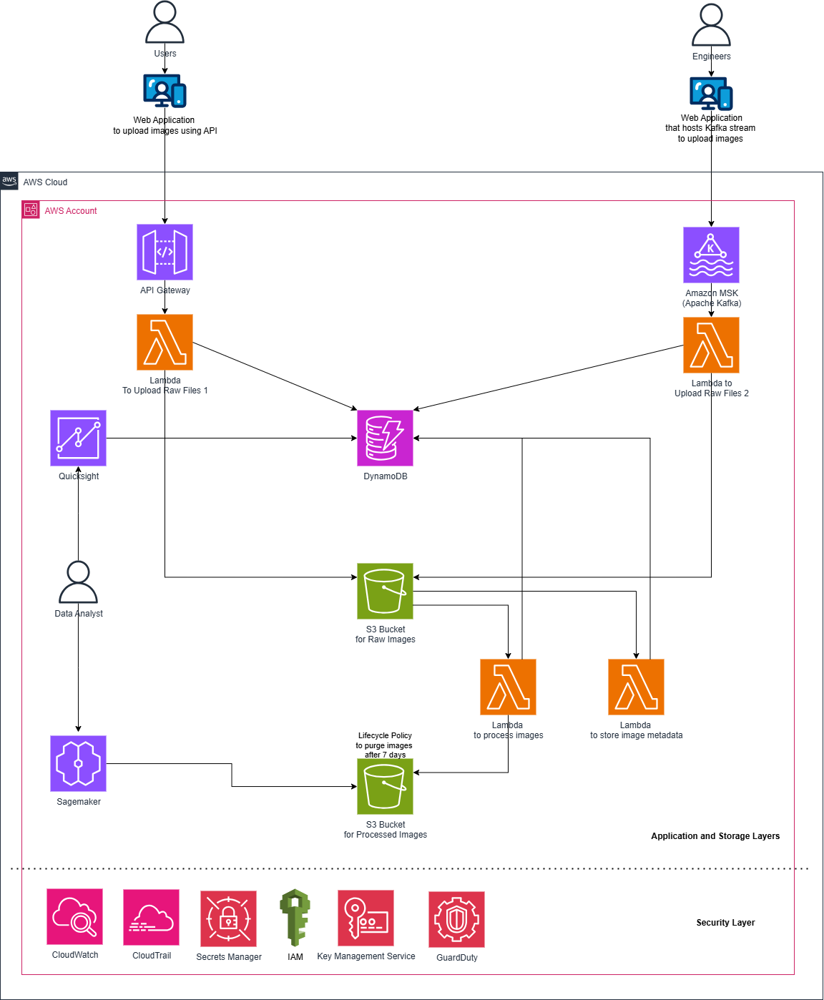

# Section3: Design 2 (Architecture Design)
---
# Table of Contents
1. [Overview](#1-overview)  
2. [Assumptions](#2-assumptions)  
3. [Explanation on Architecture (End-to-End flow)](#3-explanation-on-architecture-end-to-end-flow)  
4. [Suggested Implementation Plan and Timeline](#4-suggested-implementation-plan-and-timeline)  
5. [Suggested Roles and Ownership](#5-suggested-roles-and-ownership) 
6. [Risks and Mitigations](#6-risks-and-mitigations) 
7. [Suggested High Level Cost Considerations](#7-suggested-high-level-cost-considerations) 
8. [AWS services used in this solution](#8-AWS-services-used-in-this-solution)  
9. [Security and Best Practices Addressed in this solution](#9-security-and-best-practices-addressed-in-this-solution)  

# 1. Overview
I, as a team lead, will design cloud architecture focusing on strategic facilitator, guiding the team through the process of creating a solution that is scalable, secure, and cost-effective. My primary responsibilities include defining the project's scope, coordinating the team's efforts, and ensuring the final design aligns with the organization's business goals and technical requirements.

I propose a secure, scalable, and cost-efficient cloud architecture for ingesting and processing images from two sources (web/API uploads and an engineer-managed Kafka stream). The solution stores images and metadata for 7 days, after which they are automatically purged to meet compliance and privacy requirements. Processed metadata is available to BI and analytics tools for near-real-time insights. The design emphasizes least privilege access, encryption in transit and at rest, autoscaling processing, and operational observability.

### Key benefits:
- Meets 7-day retention/purge compliance.
- Scales automatically to demand with cost controls (spot instances / serverless).
- Provides analysts secure, read-only access to metadata and aggregates.
- Keeps raw binary transfer efficient (direct-to-object-storage uploads).
- Supports existing engineering responsibilities for Kafka and processing code.

### Role and Responsibilities:
- Executives / Product: Validate retention policy and business KPIs; approve budget tradeoffs for HA vs. cost.
- Engineers (Platform / Kafka / Processing): Manage MSK/consumer groups, container images, CI/CD, autoscaling policies.
- Analytics: Query metadata/aggregates via BI tools (read-only). Request derived datasets/ETL jobs via data team.
- Security & Compliance: Oversee key management, access policies, retention enforcement, and audits.

### Initial Planning & Requirements Gathering  
I begin by clearly defining the project's goals. This involves working with stakeholders to understand the business needs, performance expectations, and any compliance or security constraints. I document these detailed requirements, as they will serve as the foundation for the entire design process. This is also where I will help the team to choose a cloud provider (like AWS, Azure, or Google Cloud) based on their specific features, pricing, and suitability for the project. The decision of which provider to use is a crucial early step that will influence the entire architecture.

### Architectural Design & Decision Making  
Once the requirements are set, I shifts to guiding the team through the actual design of the architecture. This involves several key decisions:
- Service Selection: I, as team lead will facilitate discussions to choose the appropriate cloud services. This might include selecting services for compute (EC2, Lambda), storage (S3, EBS), databases (RDS, DynamoDB), and networking (VPC, Route 53). I encourage the team to explore various options and weigh their pros and cons.
- Scalability & Resilience: I ensure the design incorporates principles of scalability and resilience. This means designing the system to handle increased load and to recover automatically from failures. I consider using features like auto-scaling groups and multi-region deployments to achieve this.
- Security & Compliance: I ensure that security is baked into the architecture from the start, not added as an afterthought. This includes defining IAM policies, setting up network security groups, and implementing encryption for data at rest and in transit.
- Cost Management: I guide the team in making cost-effective choices. This involves considering the pricing models of different services and designing an architecture that minimizes unnecessary costs without compromising performance or reliability.

### Documentation & Communication  
I ensure that the final design is well-documented and communicated to all relevant parties. This documentation should include detailed diagrams, a list of all services used, security policies, and an explanation of the design's rationale. I also responsible for presenting the architecture to stakeholders, getting their buy-in, and addressing any questions or concerns.

### Implementation & Review  
After the design is finalized, I will oversee the implementation phase, assign tasks to team members, track progress, and ensure the implementation adheres to the architectural design. I will facilitate regular code reviews and architectural reviews to catch any deviations or potential issues early on. I mentor and support my team members throughout the process.

[Back to Top](#table-of-contents)

# 2. Assumptions
1. Cloud provider: AWS. 
2. Images are uploaded either via web API or a Kafka stream managed internally.
3. Image processing code is already written and can run in containers or serverless functions.
4. The system retains raw and processed images for up to 7 days to meet compliance requirements then automatically deleted, so DynamoDB is used for storage. If long-term retention were required and cost were not a constraint, I would instead design the solution using Redshift.
5. Business Intelligence tools require queryable storage (e.g. analytics database or data warehouse).
6. Users and analysts access the environment securely via IAM, SSO, or VPC endpoints.
7. Traffic is moderate to high; need auto-scaling and cost-efficient storage.
8. The client application restricts image uploads up to 10MB, aligning with API Gateway's payload limit.
9. AWS Lambda restricts limits up to 15 minutes per execution and up to 10GB memory / 6 vCPUs.
10. Terraform automates infrastructure provisioning, with its scripts stored and version-controlled in AWS CodeCommit.

[Back to Top](#table-of-contents)

# 3. Explanation on Architecture (End-to-End flow)

1. Image Ingestion from API-based uploads (from web app)
	- Amazon API Gateway:
		- API Gateway as a secure entry point: This is its primary function—it acts as the "front door" for your API resources.
		- Default payload limit is 10MB: AWS documentation confirms that the maximum payload size for requests sent through API Gateway (both REST and HTTP APIs) is a hard limit of 10 MB.
	- AWS Lambda (Upload Handler): Validates image, stores metadata in DynamoDB. AWS Lambda function acts as a secure intermediary. 
	- Amazon S3 (Raw Image Bucket): Stores uploaded images temporarily.

2. Image processing from Kafka-based uploads
	- Amazon MSK (Managed Kafka): Hosts the company’s Kafka topics.
	- AWS Lambda (Kafka Consumer): Reads messages, uploads image to S3, writes metadata to DynamoDB.

3. Image Processing
	- AWS Lambda 
		- Pulls images from Raw Image S3 bucket.
		- Processes images (resizing, filtering, transformations, etc.).
		- Stores processed images in S3 (Processed Images Bucket).
		- Updates metadata in DynamoDB (processed status, timestamps, analytics metadata).

4. Data Retention & Purging
	- S3 Lifecycle Policies
		- Automatically delete both raw and processed images after 7 days.
		- DynamoDB TTL (Time-To-Live) for metadata to remove entries after 7 days.
		
5. Analytics & Business Intelligence
	- AWS Sagemaker / QuickSight
		- Query processed images and metadata directly DynamoDB.
		- Analysts access dashboards via AWS QuickSight.
	- Optionally, Redshift if large-scale analytics is required.	
	
6. Security
	- IAM (Identity and Access Management) → AWS’s service for securely managing users, groups, and permissions to control access to cloud resources.
	- AWS Key Management Service (KMS) → A managed service for creating, managing, and controlling cryptographic keys to securely encrypt and decrypt data across AWS services and applications.
	- Amazon GuardDuty → A threat detection service that continuously monitors AWS accounts, workloads, and data for malicious activity and unauthorized behavior.
	- AWS Secrets Manager → Securely stores, manages, and rotates sensitive information—such as database credentials, API keys, and tokens—to protect access to applications and resources.
	
7. Scalability & Reliability
	- Amazon CloudWatch → A monitoring and observability service that collects and tracks metrics, logs, and events to provide real-time insights into AWS resources, applications, and infrastructure.
	- AWS CloudTrail → A service that records, monitors, and audits all API calls and account activity across AWS environments to ensure security and compliance.
	- AWS CloudFormation → A service that allows you to define and provision AWS infrastructure as code using templates, enabling automated, repeatable, and consistent deployments

8. Maintenance
	- Containerized processing code enables versioning and easy updates using CodeCommit.
	- AWS CodePipeline (CI/CD) → A fully managed service that automates continuous integration and continuous delivery, streamlining application and infrastructure updates.

9. Infrastructure provisioning	
	- Terraform automates infrastructure provisioning, with its scripts stored and version-controlled in AWS CodeCommit.

[Back to Top](#table-of-contents)

# 4. Suggested Implementation Plan and Timeline

A phased rollout with clear owners, QA gates, and automation:
<ins>**Phase 0 — Prep (1 week)**</ins>
- Finalize retention/compliance policy details and approvals.
- Choose cloud provider and core services (S3, MSK, ECS, Aurora, etc.)
- Create security baseline (KMS key policies, VPC overall network).

<ins>**Phase 1 — Core Infra & Storage (2 weeks)**</ins>
- IaC: Terraform/CloudFormation for object storage buckets, lifecycle rules, KMS, VPC endpoints.
- Create staging buckets and lifecycle policy (7 days).
- Set up CI/CD skeleton.

<ins>**Phase 2 — Ingestion Paths (2–3 weeks)**</ins>
- Implement API Gateway + pre-signed upload flow; WAF rules.
- Stand up MSK and sink connector to storage (or custom consumer).
- Validate end-to-end ingestion to raw bucket.

<ins>**Phase 3 — Processing & Metadata (2–3 weeks)**</ins>
- Containerize processing code; build ECR images; deploy to ECS/EKS.
- Implement S3->queue->workers pipeline; integrate DB for metadata.
- Add provisioning for autoscaling policies (queue-based).

<ins>**Phase 4 — Analytics & BI (1–2 weeks)**</ins>
- Catalog S3 datasets with Glue or native metadata store.
- Connect BI tool and create sample dashboards.

<ins>**Phase 5 — Security, Testing, & Release (1–2 weeks)**</ins>
- Pen test & security review.
- Perform DR/recovery drills and compliance verification.
- Full production rollout and monitoring baseline.

<ins>**Total estimated time: ~8–11 weeks depending on team size and approvals.**</ins>

# 5. Suggested Roles and Ownership
- Platform / Infra Lead: IaC, VPC, KMS, storage lifecycle rules.
- Kafka Engineers: Manage Kafka topics, connectors, security.
- Processing Team: Containerize and maintain processing code, CI/CD.
- Data/Analytics: Glue catalog, dataset schemas, BI dashboards.
- Security/Compliance: IAM policies, audit review, retention enforcement.

# 6. Risks and Mitigations
- Risk: Accidental retention beyond 7 days due to snapshots/backups.
	- Mitigation: Policy to exclude images from long-term backups; if backups required, encrypt and enforce retention consistent with compliance.
- Risk: High ingestion spikes cause unaffordable costs.
	- Mitigation: Autoscaling + rate limiting; cost alerts; use spot where feasible.
- Risk: Data leakage via misconfigured buckets.
	- Mitigation: Apply strict bucket policies, block public access, use VPC endpoints and access logs.
- Risk: Kafka consumer lag causing processing backlog.
	- Mitigation: Monitor consumer lag and scale consumers/partitions; use managed MSK for operational simplicity.

# 7. Suggested High Level Cost Considerations
- Primary costs: object storage (short retention reduces storage cost), compute for processing, managed Kafka, and DB.
- Cost controls: delete in 7 days, use serverless DB or right-sized instances, use spot instances for batch-processing workers.
- Monitor with cost alarms and tagging for allocation.

# 8. AWS services used in this solution

1. Amazon API Gateway: A fully managed service that enables developers to create, publish, secure, and monitor APIs at any scale.
2. Apache Kafka: A distributed streaming platform that allows real-time publishing, storing, and processing of high-throughput event and message streams.
3. AWS Lambda: A serverless compute service that runs code in response to events without requiring you to provision or manage servers.
4. Amazon DynamoDB: A fully managed, serverless NoSQL database that provides fast and predictable performance with seamless scalability.
5. Amazon QuickSight: A cloud-based business intelligence service that enables users to create interactive dashboards, visualizations, and insights from their data.
6. Amazon S3 (Simple Storage Service) bucket: A scalable, durable cloud storage container used to store and retrieve objects such as files, images, and backups.
7. Amazon SageMaker: A fully managed service that enables developers and data scientists to build, train, and deploy machine learning models at scale

[Back to Top](#table-of-contents)	

# 9. Security and Best Practices Addressed in this solution

1. Secure access
	- IAM roles & policies enforces least-privilege access.
	- AWS KMS encrypts S3, Redshift, and SageMaker data.
	- AWS CloudTrail enables auditing.
	- RBAC for Redshift and restricted access for QuickSight & SageMaker.
	- AWS best practice for securing data in transit is to encrypt all traffic. This ensures that data is unreadable even if it's intercepted as it moves across networks. 
		- Encrypting External Traffic
			When data moves between your users or on-premises environment and AWS, it travels over the public internet. This traffic must be encrypted.
				- Use TLS/SSL: Always use Transport Layer Security (TLS), the successor to SSL, to secure client-to-server communications. AWS services like Elastic Load Balancing (ELB), API Gateway, and CloudFront seamlessly integrate with AWS Certificate Manager (ACM) to provision and manage free SSL/TLS certificates. This offloads the encryption and decryption work, ensuring a secure HTTPS connection.
				- Secure Remote Access: For connecting to instances or managing infrastructure, use secure protocols like SSH (for EC2 instances) and AWS Systems Manager Session Manager which provides a secure, auditable, and browser-based shell without opening inbound ports.
				- VPN and Direct Connect: For hybrid cloud setups, establish secure connections between your data center and AWS. A Site-to-Site VPN creates an encrypted tunnel over the internet, while a Direct Connect provides a private, dedicated network link. For maximum security, you can use a VPN over a Direct Connect connection.

		- Encrypting Internal Traffic 🔒
			It's also a best practice to encrypt data that stays within the AWS network, even between services in the same Virtual Private Cloud (VPC).
			- VPC Endpoints and AWS PrivateLink: Use VPC Endpoints to create private connections to AWS services like S3 or DynamoDB from within your VPC. This ensures that traffic to those services doesn't leave the Amazon network, reducing exposure. AWS PrivateLink extends this concept, allowing you to create private connections to your own or third-party services.
			- Service-Level Encryption: Most AWS services offer native support for encryption in transit. For example, you can configure Amazon RDS to enforce SSL/TLS for all database connections. Check the documentation for each service you use to enable this feature.
			- Network Access Control: Use Security Groups and Network Access Control Lists (NACLs) to control inbound and outbound traffic at both the instance and subnet level. While they don't encrypt traffic, they are a critical component of a layered security strategy, acting as firewalls to restrict who and what can communicate with your resources

2. Scaling
	- AWS Lambda, DynamoDB, and SageMaker auto-scale on demand.
	- Amazon MSK handles high-throughput workloads.
	- Redshift Serverless adjusts resources dynamically.
	
3. Manageability
	- Secure credentials via AWS Secrets Manager.
	- Encryption keys managed by AWS KMS.
	- Terraform used for IaC to ensure consistent provisioning.

4. Maintenance 
	- AWS CodePipeline automates CI/CD.
	- Containerized processing
	- Version control

5.  High Availability (HA)
	- MSK Multi-AZ deployment and Redshift Serverless.
	- S3 durability and fault tolerance.
	
6. Cost Efficiency
	- Serverless services minimize idle costs.
	- S3 lifecycle policies optimize storage costs.
	- Redshift Serverless and QuickSight pay-per-use pricing	
	- S3 storage class optimization
	
7.  Fault Tolerance & Disaster Recovery (DR)
	- MSK event replay and S3 versioning for recovery.
	- DynamoDB PITR and Redshift snapshots enable rollback.	
	- Multi-AZ deployments
	- S3 replication optional
	
8. Low Latency
	- Direct S3 ingestion.
	- Event-driven Lambda triggers
	- Regional deployment reduces network latency.
	- Redshift Serverless optimizes queries dynamically.	
	
[Back to Top](#table-of-contents)	